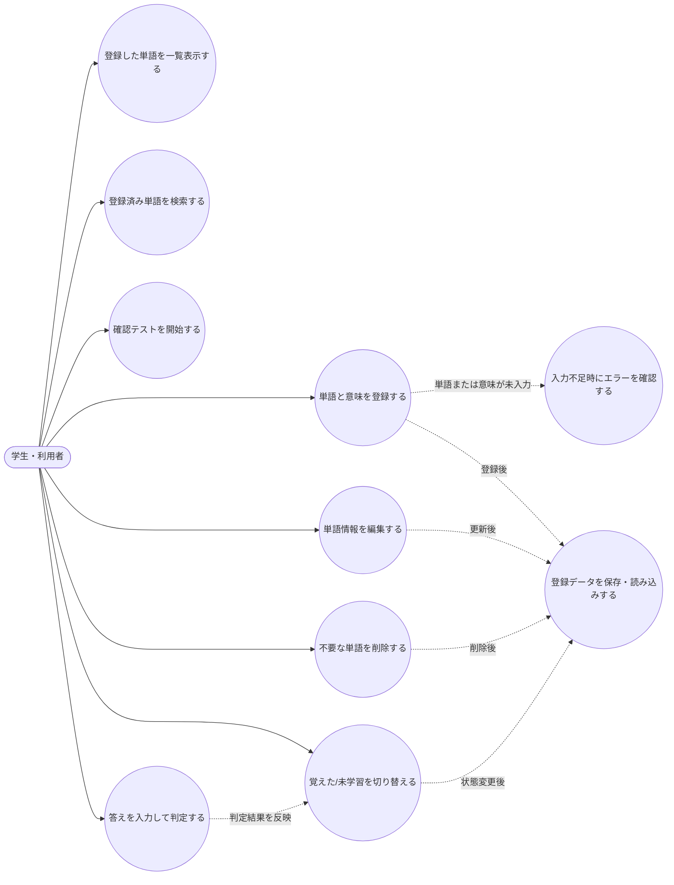
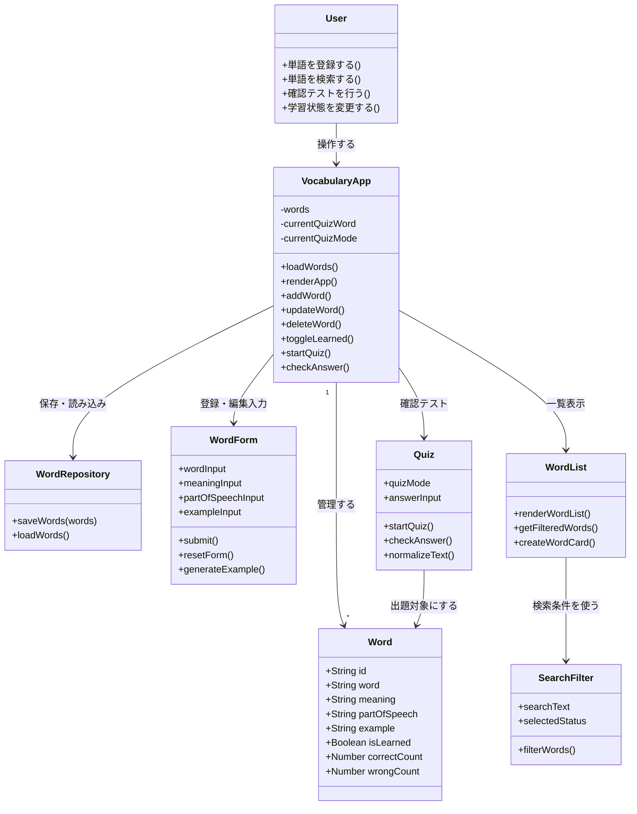
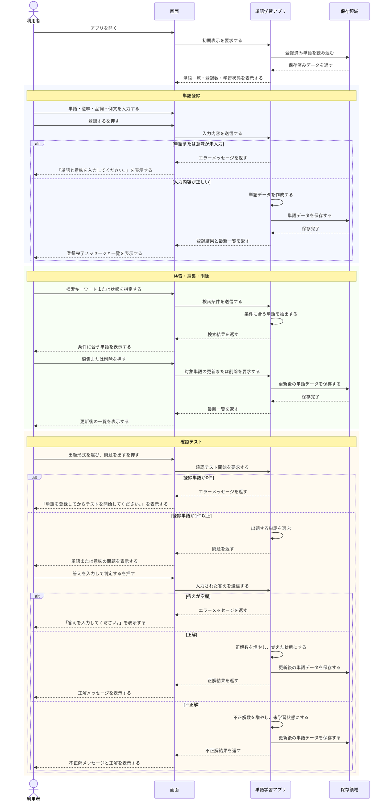
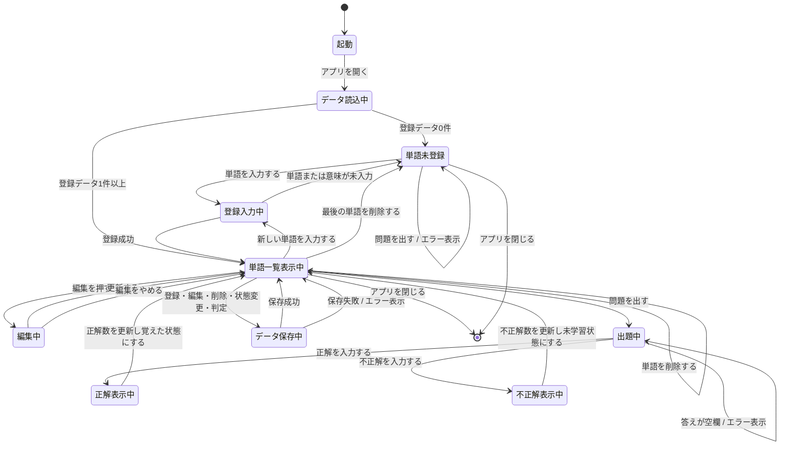

## 単語学習アプリの設計図

### ユースケース図

### クラス図

### シーケンス図

### 状態遷移図

## テスト項目表

| # | テスト対象 | テスト観点(正常/境界/異常) | テスト条件 | テスト手順(1行) | 期待値(1行) | 結果(○/×) |
|---:|---|---|---|---|---|---|
| 2 | 単語登録 | 正常 | 単語と意味のみ入力する | 単語に`algorithm`、意味に`問題を解くための手順`を入力して「登録する」を押す | 「単語を登録しました。」と表示され、一覧の先頭に単語が追加され、登録数1・未学習1になる | ○ |
| 3 | 単語登録 | 正常 | 単語・意味・品詞・例文をすべて入力する | 単語に`variable`、意味に`変数`、品詞に`名詞`、例文に`This variable stores a value.`を入力して「登録する」を押す | 一覧に品詞と例文付きで表示され、登録数が1増える | ○ |
| 4 | 単語登録 | 境界 | 必須項目の単語が空欄 | 単語を空欄、意味に`変数`を入力して「登録する」を押す | 「単語と意味を入力してください。」と表示され、単語は追加されない | ○ |
| 5 | 単語登録 | 境界 | 必須項目の意味が空欄 | 単語に`variable`、意味を空欄にして「登録する」を押す | 「単語と意味を入力してください。」と表示され、単語は追加されない | ○ |
| 6 | 単語登録 | 境界 | 単語と意味が半角スペースだけ | 単語に半角スペース3個、意味に半角スペース3個を入力して「登録する」を押す | 空欄扱いとなり「単語と意味を入力してください。」と表示され、単語は追加されない | ○ |
| 7 | 単語登録 | 境界 | 入力値の前後に空白がある | 単語に`  class  `、意味に`  分類  `を入力して「登録する」を押す | 前後の空白が除去され、一覧には`class`と`分類`として登録される | ○ |
| 8 | 例文自動作成 | 境界 | 単語が未入力 | 単語を空欄にして「例文を自動作成」を押す | 「例文を作るには、先に単語を入力してください。」と表示され、例文欄は変更されない | ○ |
| 9 | 例文自動作成 | 正常 | 品詞が名詞 | 単語に`algorithm`、意味に`手順`、品詞に`名詞`を入力して「例文を自動作成」を押す | 例文欄に`The algorithm is important for understanding this topic.`が入る | ○ |
| 10 | 例文自動作成 | 正常 | 品詞が動詞 | 単語に`compile`、意味に`コンパイルする`、品詞に`verb`を入力して「例文を自動作成」を押す | 例文欄に`I need to compile it carefully.`が入る | ○ |
| 11 | 例文自動作成 | 正常 | 品詞が未入力で意味が入力済み | 単語に`stack`、意味に`データ構造`、品詞を空欄にして「例文を自動作成」を押す | 例文欄に`The term "stack" means "データ構造".`が入る | ○ |
| 12 | 例文自動作成 | 境界 | 既存の例文があり、上書き確認でキャンセルする | 例文欄に`Original example.`を入力し、単語に`queue`を入力して「例文を自動作成」を押し、確認ダイアログでキャンセルを押す | 例文欄は`Original example.`のまま変更されない | ○ |
| 13 | 例文自動作成 | 正常 | 既存の例文があり、上書き確認でOKする | 例文欄に`Original example.`を入力し、単語に`queue`、意味に`待ち行列`を入力して「例文を自動作成」を押し、確認ダイアログでOKを押す | 例文欄が自動作成された例文に上書きされる | ○ |
| 14 | 入力クリア | 正常 | 登録フォームに入力途中の値がある | 単語・意味・品詞・例文に任意の値を入力して「入力をクリア」を押す | 入力欄がすべて空になり、保存ボタン表示は「登録する」になる | ○ |
| 15 | 単語一覧表示 | 正常 | 品詞と例文が未設定の単語が登録済み | 単語と意味だけで登録した単語カードを一覧で確認する | 品詞は「品詞未設定」、例文は「例文: 未設定」と表示される | ○ |
| 16 | 学習状態切替 | 正常 | 未学習の単語が1件以上ある | 未学習の単語カードで「覚えたにする」を押す | 状態バッジが「覚えた」になり、覚えた数が1増え、未学習数が1減る | ○ |
| 17 | 学習状態切替 | 正常 | 覚えた状態の単語が1件以上ある | 覚えた単語カードで「未学習に戻す」を押す | 状態バッジが「未学習」になり、覚えた数が1減り、未学習数が1増える | ○ |
| 18 | 単語編集 | 正常 | 登録済み単語が1件以上ある | 単語カードの「編集」を押し、意味を別の内容に変更して「更新する」を押す | 「単語を更新しました。」と表示され、一覧の該当単語の内容が更新される | ○ |
| 19 | 単語編集キャンセル | 正常 | 編集中の状態である | 単語カードの「編集」を押してフォームに値が入った状態で「編集をやめる」を押す | 編集状態が解除され、フォームが空になり、保存ボタン表示が「登録する」に戻る | ○ |
| 20 | 単語削除 | 正常 | 登録済み単語が1件以上ある | 単語カードの「削除」を押し、確認ダイアログでOKを押す | 該当単語が一覧から消え、登録数が1減る | ○ |
| 21 | 単語削除 | 境界 | 削除確認でキャンセルする | 単語カードの「削除」を押し、確認ダイアログでキャンセルを押す | 該当単語は削除されず、登録数も変わらない | ○ |
| 22 | 検索・絞り込み | 境界 | 検索条件に一致する単語がない | 検索欄に登録データに含まれない`zzzz`を入力する | 一覧が空になり、「条件に合う単語はありません。」と表示される | ○ |
| 23 | 確認テスト | 境界 | 単語が未登録 | 登録データをすべて削除した状態で「問題を出す」を押す | 「単語を登録してからテストを開始してください。」と表示され、問題は開始されない | ○ |
| 24 | データ保存 | 正常 | 単語を登録済み | 単語を1件登録してからブラウザを再読み込みする | 登録した単語が再読み込み後も一覧に残っている | ○ |
